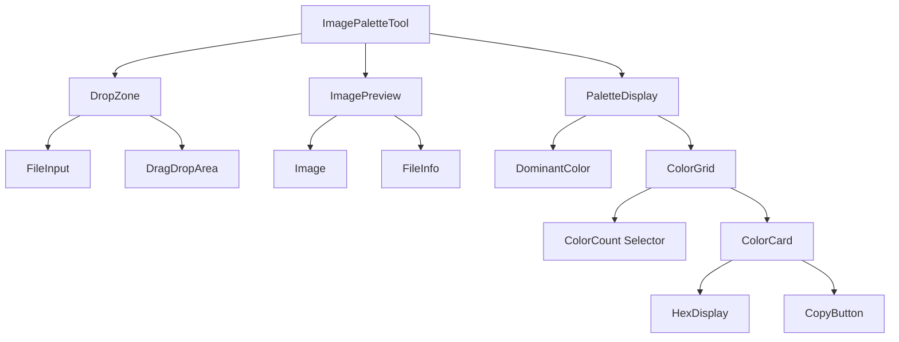
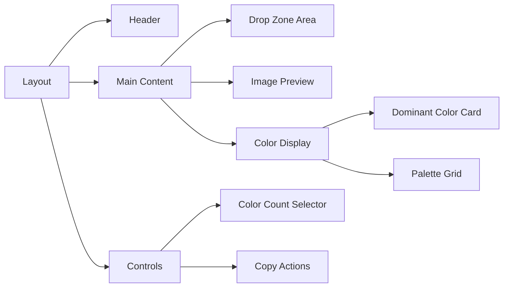
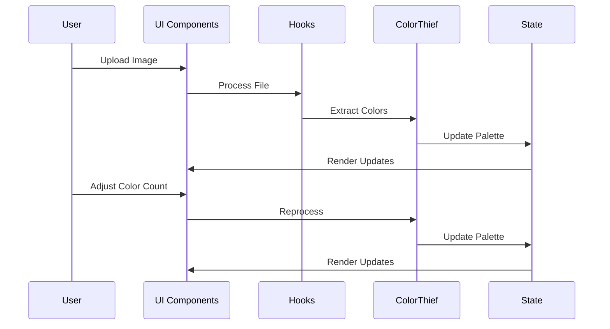

# Image Palette Tool Implementation Plan

## Overview

Implementation plan for a new tool that extracts color palettes from uploaded images using the color-thief package, with support for dominant color extraction and customizable palette sizes.

## Tool Configuration

```javascript
{
  name: "Image Palette",
  description: "Extract color palettes from images using color-thief. Features dominant color detection and customizable palette size.",
  path: "/tools/image-palette",
  icon: <IconPalette size={20} />,
  component: lazy(() => import("../components/tools/ImagePaletteTool")),
}
```

## Technical Specifications

### File Handling

- Maximum file size: 5MB
- Supported formats: .jpg, .jpeg, .png, .webp
- Client-side validation and compression
- Error handling for oversized/invalid files

### Color Processing

- Default palette size: 4 colors
- Maximum palette size: 8 colors
- Quality parameter for color-thief: 10 (best quality)
- Color format: HEX with RGB conversion for display

## Component Structure



## Directory Structure

```
src/
  components/
    tools/
      ImagePaletteTool/
        index.jsx
        DropZone.jsx
        ColorPaletteDisplay.jsx
  hooks/
    useImageProcessing.jsx
  utils/
    imageUtils.js
```

## UI Layout



## Data Flow



## Custom Hooks

### useImageProcessing

- Handle image loading
- Process image data
- Extract colors using color-thief
- Error handling

### usePaletteState

- Manage palette size
- Store color data
- Handle color count updates

### useFileValidation

- Validate file types
- Check file size
- Handle validation errors

### useColorThief

- Wrap color-thief operations
- Handle color extraction
- Manage quality settings

## UI/UX Considerations

### Styling

- Consistent with Chakra UI theme
- Responsive grid layout
- Color cards with elevation
- Hover effects with color information
- Smooth transitions

### Accessibility

- Color contrast compliance
- Keyboard navigation
- Screen reader support
- Alternative text for images

## Performance Optimizations

- Lazy loading of color-thief package
- Debounced color processing
- Memoized color calculations
- Progressive image loading
- Optimized re-renders

## Error Handling

- Invalid file types
- File size exceeded
- Processing failures
- Network issues
- Color extraction errors

## Testing Considerations

- Unit tests for hooks
- Component testing
- File handling validation
- Color extraction accuracy
- UI interaction testing
