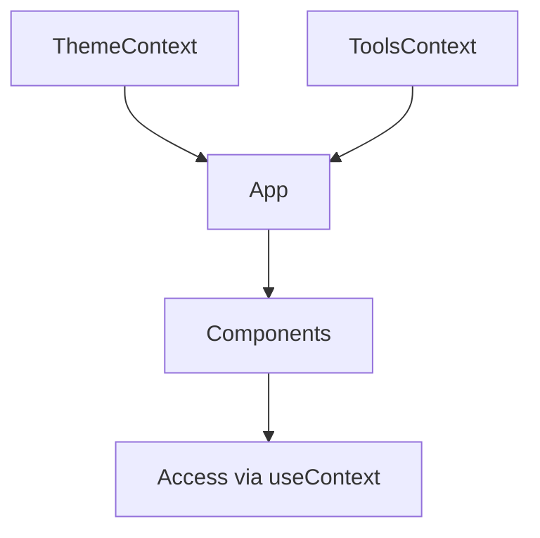
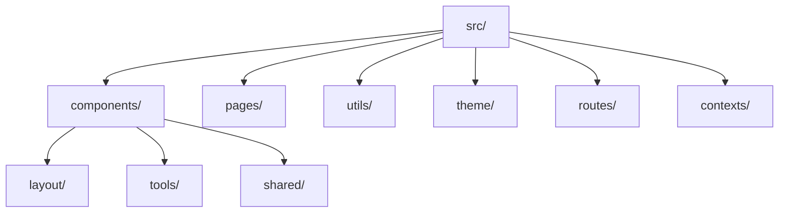
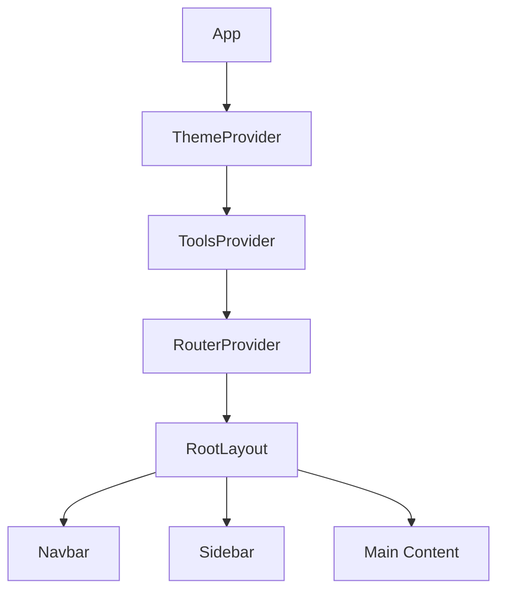

# Developer Tools Web Application - Implementation Plan

## Project Overview

A modern developer tools web application using React, Chakra UI, and React Router, featuring a clean dark theme design and essential developer utilities.

## Technical Stack

- React (with Hooks and Context API)
- Chakra UI
- React Router DOM
- Basic JSX implementation

## React Concepts Implementation

### Context API Usage



1. ThemeContext

   - Manages dark mode preferences
   - Provides theme customization
   - Used with useContext hook

2. ToolsContext
   - Manages tool states and configurations
   - Shares common tool functionalities
   - Handles tool history and favorites

### Hook Usage

1. useState

   - Tool input/output states
   - UI state management
   - Form controls

2. useEffect

   - Side effects handling
   - API integrations
   - DOM manipulations

3. useCallback

   - Optimization for tool functions
   - Event handler memoization

4. useMemo

   - Complex calculations in tools
   - Derived state computations

5. useRef
   - DOM element references
   - Previous value tracking
   - Input focus management

## Project Structure

### Directory Organization



### Component Architecture



## Implementation Phases

### Phase 1: Project Setup

1. Dependencies Installation

   ```bash
   npm install @chakra-ui/react @emotion/react @emotion/styled framer-motion react-router-dom @chakra-ui/icons
   ```

2. Context Setup

   ```jsx
   // contexts/ThemeContext.jsx
   const ThemeContext = createContext();

   export const ThemeProvider = ({ children }) => {
     const [darkMode, setDarkMode] = useState(true);
     return (
       <ThemeContext.Provider value={{ darkMode, setDarkMode }}>
         {children}
       </ThemeContext.Provider>
     );
   };
   ```

### Phase 2: Tool Implementation

#### Base64 Tool

```jsx
// components/tools/Base64Tool.jsx
const Base64Tool = () => {
  const [input, setInput] = useState('');
  const [output, setOutput] = useState('');

  const handleEncode = useCallback(() => {
    setOutput(btoa(input));
  }, [input]);

  return (
    // JSX implementation
  );
};
```

#### Color Picker Tool

```jsx
// components/tools/ColorPickerTool.jsx
const ColorPickerTool = () => {
  const [color, setColor] = useState('#000000');
  const [format, setFormat] = useState('hex');

  const convertedColor = useMemo(() => {
    // Color conversion logic
  }, [color, format]);

  return (
    // JSX implementation
  );
};
```

### Phase 3: Shared Components

1. ToolCard Component

```jsx
const ToolCard = ({ title, description, icon, path }) => {
  const navigate = useNavigate();
  return (
    // JSX for tool card
  );
};
```

2. CopyButton Component

```jsx
const CopyButton = ({ text }) => {
  const [copied, setCopied] = useState(false);
  const handleCopy = () => {
    navigator.clipboard.writeText(text);
    setCopied(true);
    setTimeout(() => setCopied(false), 2000);
  };
  return (
    // JSX for copy button
  );
};
```

## File Structure

```
src/
├── contexts/
│   ├── ThemeContext.jsx
│   └── ToolsContext.jsx
├── components/
│   ├── layout/
│   │   ├── Navbar.jsx
│   │   ├── Sidebar.jsx
│   │   └── Footer.jsx
│   ├── tools/
│   │   ├── Base64Tool.jsx
│   │   └── ColorPickerTool.jsx
│   └── shared/
│       ├── ToolCard.jsx
│       └── CopyButton.jsx
├── pages/
│   ├── HomePage.jsx
│   └── ToolPage.jsx
├── routes/
│   └── index.jsx
├── theme/
│   └── index.js
├── utils/
│   ├── base64.js
│   └── colors.js
├── App.jsx
└── main.jsx
```

## Routing Structure

```jsx
// routes/index.jsx
const router = createBrowserRouter([
  {
    path: "/",
    element: <RootLayout />,
    children: [
      {
        index: true,
        element: <HomePage />,
      },
      {
        path: "tools/base64",
        element: <Base64Tool />,
      },
      {
        path: "tools/color-picker",
        element: <ColorPickerTool />,
      },
    ],
  },
]);
```

## Next Steps

1. Initialize project structure
2. Set up contexts and providers
3. Implement basic layout components
4. Create tool components
5. Add routing configuration
6. Style with Chakra UI
7. Add error boundaries and testing
